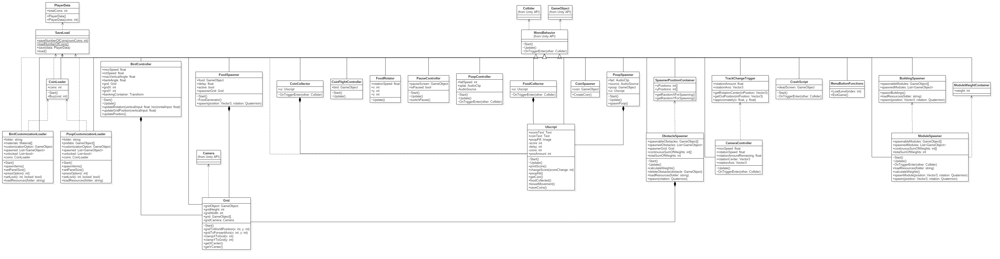

# Justice Bird

  Project for COP4331-Fall 2017
  
  | Group Members |
  |:-------------:|
  | @3alanhdez - Alan Hernandez |
  | @kingofspill - Grant Goodman |
  | @marcburrell - Marc Burrell |
  | @mohammadh94 - Mohammad Hammad |
  | @sustx - William Tyback Rojas |

## Vision Statement

&nbsp;&nbsp;&nbsp;&nbsp;&nbsp;&nbsp;We are living in a time of history where it seems like every time you hear about the news, you get ready for something disappointing, enraging, frightening, and sometimes all three. So for those who need a break from the chaos we now call news we have released Justice Pigeon, a game which allows you to fly across various terrains as a bird while also avoiding obstacles and gaining points along the way. The best part of our game however is the ability to defecate on the heads of those who you are tired of seeing on the news every single week. On the contrary of what you may be thinking, our birds are bipartisan so everybody has an equal oppurtunity to get pooped on, no matter their political views. Our game is a fun way to unwind and can even provide a method of relief from the daily news. This supports our company’s strategy to release games which are not only exciting but also relevant to the current times.  

## Product Backlog

  ### User Stories
 
  | UID | User Story |
  |---:|:-----------|
  | 00 | “As a player, I want to be able to start the game, so I can play.” |
  | 01 | “As a player, I want to be able to pause the game, so that I can take breaks from it.” |
  | 02 | "As a player, I want the world to change each time I play, so that the game stays fun over time" |
  | 03 | “As a player, I want a way to track my progress, so I can visualize my accomplishment." |
  | 04 | “As a player, I want a way to view the interesting objects in my nest, so I can visualize my collection.”|
  | 05 | “As a player, I want to be able to adjust graphics settings, so I can ensure good performance on my device.” |
  | 06 | “As a player, I want a way to score my ability, so that I can compare myself with other players.” |
  | 07 | “As a player, I want to be able to save my progress on exiting the game, so that I can return later.” |
  | 08 | "As a player, I want to be able to exit the game, so that I can do other things." |
  | 09 | "As a player, I want to be able to control the bird, so I can explore and interact with the game world." |
  | 10 | "As a player, I want to collect coins, so that I can buy things." |
  | 11 | "As a bird,   I want to be able to eat food, so that I can poop on things." |
  | 12 | "As a player, I want to be able to change how my poop looks, so I can feel ownership over my game." |
  | 13 | "As a bird,   I want to be able to poop on things, so that I can eat more food." |
  | 14 | "As a player, I want to be able to customize my bird, so I can feel ownership over my game" | 
  | 15 | "As a player, I want a central location that displays my choices, so I can choose what to do." |
  
  ### Functional Requirements

  | RID | UID | Feature | Assigned To | Points |
  |---:|--------------:|:--------|:------:|:-----:|
  | 00 | 01 | The game shall allow the player to pause the game                | @kingofspill |1|
  | 01 | 01 | The game shall allow the player to un-pause the game             | @kingofspill |1|
  | 02 | 09 | The game shall allow the player to control the bird’s flight     | @kingofspill |2|
  | 03 | 09 | The game shall allow the player to make the bird poop            | @mohammadh94 |3|
  | 04 | 02 | The game shall generate a cityscape modularly                    | @kingofspill |8|
  | 05 | 02 | The game shall have a set of modular city tiles                  | @3alanhdez   |8|
  | 06 | 04 | The game shall allow the player to view total collected coins    | @marcburrell |3|
  | 07 | 06 | The game shall display a score, dependant on the player's actions| @marcburrell |2|
  | 08 | 08 | The game shall allow the player to exit the application          | Unassigned   |1|
  | 09 | 02 | The game shall generate non playable characters pseudo-randomly  | @kingofspill |8|
  | 10 | 10 | The game shall allow the player to collect collectable items     | @suxstx   |5|
  | 11 | 11 | The game shall generate food pseudo-randomly                     | @sustx |8|
  | 12 | 05 | The game shall provide a method for changing common graphical settings | Unassigned   |1|
  | 13 | 03 | The game shall allow the player to see the available poop | @mohammadh94 |5|
  | 14 | 07 | The game shall store persistent player progress                  | Unassigned   |8|
  | 15 | 07 | The game shall allow the player to load previously stored progress | Unassigned   |5|
  | 16 | 12 | The game shall allow the player to change the bird's poop cosmetically | Unassigned   |5|
  | 17 | 03 | The game shall track the total number of coins the player has collected | @sustx |1|
  | 18 | 14 | The game shall allow players to spend in-game currency on alternative skins for the bird and poop | Unassigned   |13|
  | 19 | 09 | The game shall end play when the bird collides with environment objects | @marcburrell   |3|
  | 20 | 08 | The pause screen shall give a way to exit the game | Unassigned | 3 |
  | 21 | 01 | The pause screen shall allow the player to quit to a main menu | Unassigned | 3 |
  | 22 | 15 | The game shall have a main menu | @kingofspill | 3 |
  | 23 | 00 | The main menu shall allow the player to start the game | @kingofspill | 1 |
  | 24 | 08 | The main menu shall allow the player to quit the game | @kingofspill | 3 |
  | 25 | 14 | The main menu shall allow the player to go to a customization page | Unassigned | 3 |
  | 26 | 13 | The game shall add poop as the bird collects food | @marcburrell | 3 |
  | 27 | 10 | The game shall spawn coins when poop hits non-playable characters | @3alanhdez | 5 |
  | 28 | 06 | The game shall increase score as the player survives longer | @marcburrell | 2 |
  | 29 | 13 | The game shall have a set of non-playable characters to spawn | @3alanhdez | 5 |
  | 30 | 11 | The game shall have food models to spawn | @sustx | 3 |
  
  ### Unit Tests
  | TID | Test Description | RID Being Tested |
  |:---:|:-----------------|:----------------:|
  | 00  | The pause button pauses the game | 00 |
  | 01  | The unpause button unpauses the game | 01 |
  | 02  | The bird moves up when you press 'up' button | 02 |
  | 03  | The bird moves down when you press 'down' button | 02 |
  | 04  | The bird moves left when you press 'left' button | 02 |
  | 05  | The bird moves right when you press 'right' button | 02 |
  | 06  | The bird doesn't move past the left edge | 02 |
  | 07  | The bird doesn't move past the right edge | 02 |
  | 08  | The bird doesn't move past the up edge | 02 |
  | 09  | The bird doesn't move past the down edge | 02 |
  
  

  ### Sprint 1
  
  | Feature RID | Status | Assigned To | Points |
  |:----:|:------:|:------:|:----:|
  | 02  | Complete | @kingofspill | 2 |
  | 04  | In Progress | @3alanhdez   | 5 |
  | 05  | Complete | @3alanhdez   | 5 |
  | 06  | Complete | @marcburrell | 2 |
  | 07  | Complete | @marcburrell | 2 |
  
  ### Sprint 1 Burndown Chart
 
 
  
  ### Sprint 2 Backlog
  
  | Feature RID | Status | Assigned To | Points |
  |:----:|:------:|:------:|:----:|
  | 00  | Complete (06/17) | @kingofspill | 1  |
  | 01  | Complete (06/17) | @kingofspill | 1  |
  | 03  | Not Started | @mohammadh | 3  |
  | 04  | Complete (06/29) | @kingofspill | 8  |
  | 05  | Complete | @3alanhdez | 8  |
  | 06  | Complete | @marcburrell | 3  |
  | 07  | Complete | @marcburrell | 2  |
  | 09  | Complete (06/28) | @kingofspill | 8  |
  | 11  | Complete (06/29)| @sustx | 8  |
  | 13  | Not Started | @mohammadh | 5  |
  | 17  | Complete (06/20) | @sustx | 1  |
  | 19  | Not Started | @marcburrell | 3  |
  | 22  | Complete (06/17) | @kingofspill | 3  |
  | 23  | Complete (06/17) | @kingofspill | 1  |
  | 24  | Complete (06/17) | @kingofspill | 3  |
  | 26  | Not Started | @marcburrell | 3  |
  | 27  | Not Started | @3alanhndez | 5  |
  | 28  | Complete | @marcburrell | 2  |
  | 29  | Completed | @3alanhndez | 5  |
  | 30  | Complete (06/20) | @sustx | 3  |
  
  ### Sprint 3 Backlog
  
  
  | Feature RID | Status | Assigned To | Points |
  |:----:|:------:|:------:|:----:|
  | 00  | Not Started | Unassigned | __ |
  | 01  | Not Started | Unassigned | __ |
  | 08  | Not Started | Unassigned | __ |
  | 12  | Not Started | Unassigned | __ |
  | 14  | Not Started | Unassigned | __ |
  | 15  | Not Started | Unassigned | __ |
  | 18  | Not Started | Unassigned | __ |
  
  
  

## Design Specification

